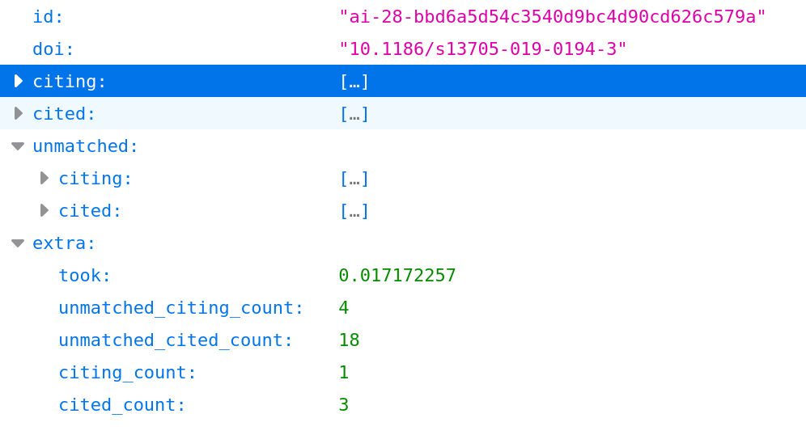

# Meeting Minutes

> 2021-09-20, 1300, ...

## Topics

* [ ] abstract "id-to-index-document" a bit more; layered approach, e.g. live
  (all to solr); prefetch (solrdump/microblob/sqlite3/pg); caching (after each
  request); with a TTL; maybe some url with a wildcard for id, e.g.
  "http://hello.world/r/{{ id }}"

> We have 3+1 backends, sqlite3, microblob, solr; can add mysql or pg as well
> with a little adapter; sqlite3 (fetchall) seems the most performant so far;
> we could also group backends for cascading or hedged requests

* [ ] support non-source items, e.g.

```json
{
    ...
    "matched": {          |
        "citing": ...     | ... index schema (any, could be just an id)
        "cited": ...      |
    },                    |

    "unmatched": {        | maybe PDA, etc
        "citing": ...     | ... doi
        "cited": ...      |
    }                     |
    ...
}
```

> implemented, a current example: [https://i.imgur.com/uJAWsAE.png](https://i.imgur.com/uJAWsAE.png)



* [ ] prepare deployment; VM in progress; 8; 16; 500G; debian 10; systemd unit
    * [ ] tools to generate suitable data stores (e.g. via OCI, a copy of solr, etc.)
    * [ ] a service unit for the server
    * [ ] implement HTTP cache policy
    * [ ] some frontend like nginx
    * [ ] an ansible playbook for tools and service

## Notes

...
